# InvForge — AI Operations Control Tower

[](https://github.com/dannzapper-cmd/project-3/actions/workflows/ci.yml)

InvForge is an external **AI Operations sidecar** on top of [InvenTree](https://inventree.org/) — an open-source inventory management system. It turns inventory events and demand history into forecast-informed decisions, risk flags, reorder recommendations, model health checks, and auditable operational evidence — **without modifying InvenTree core**.

> **Status:** PR-01 through PR-13 merged. PR-14 adds a live Cloud Run demo of the read-only AI Operations API.

## What this demonstrates

- **Sidecar architecture** — clean integration over enterprise open-source, not a fork
- **ML pipeline** — LightGBM + StatsForecast + Croston/SBA with p10/p50/p90 quantiles
- **Decision intelligence** — safety stock, ROP, EOQ, stockout risk from forecasts
- **MLOps loop** — Evidently drift, MLflow registry, champion/challenger, BentoML, ZenML retraining
- **Observability** — `/health`, `/metrics`, local Prometheus/Grafana, optional kind LGTM stack
- **Defensive security** — audit pipeline, CI scanning, mutation blocking in demo/cloud mode
- **Cloud-ready deploy templates** — GCP Cloud Run (primary), AWS ECS Fargate, Azure Container Apps

## Screenshots

Captured from locally running services after `make demo-local`. The **System Flow**
panel shows the backend pipeline chain this dashboard reads — not a frontend-only demo.

| System flow (backend chain) | Dashboard overview | Decision intelligence |
|---|---|---|
| 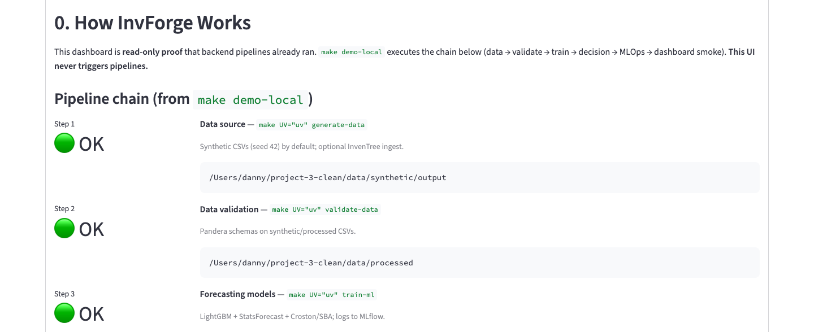 | 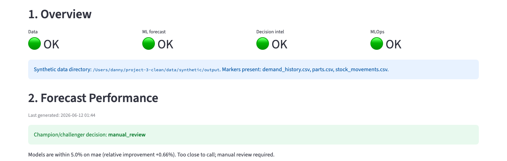 | 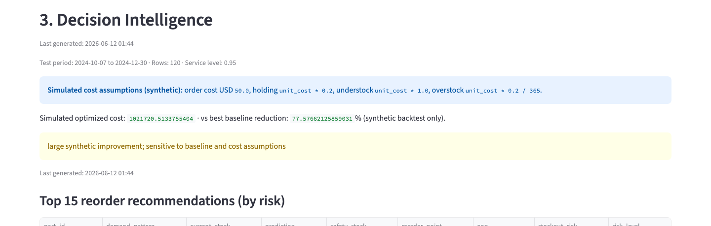 |

| API health | API docs | Grafana (local) |
|---|---|---|
| 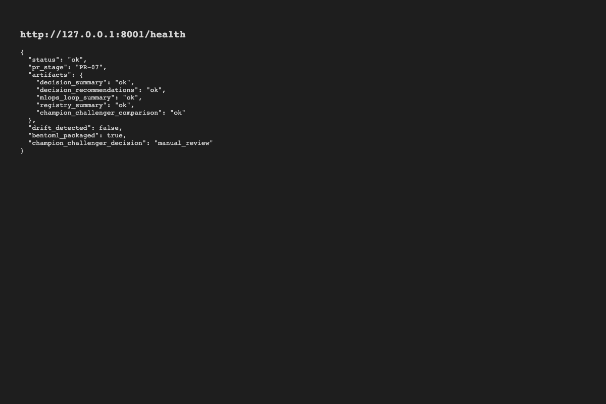 | 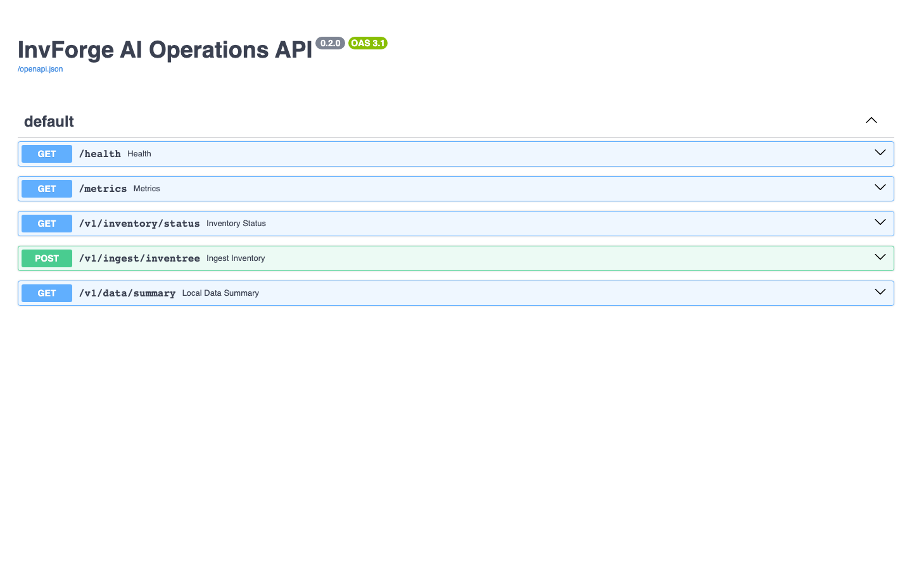 | 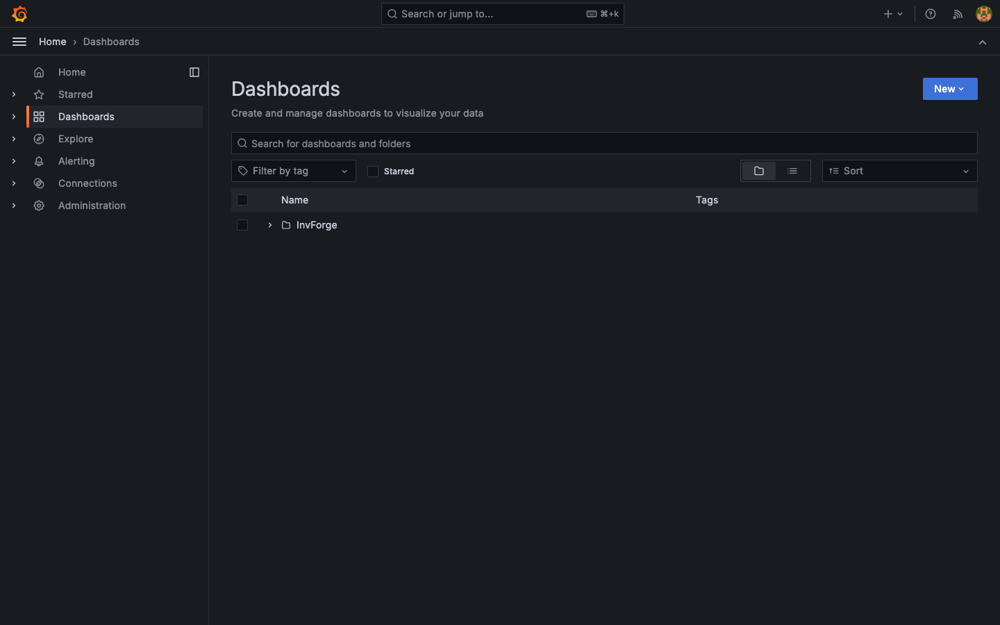 |

| Marquez lineage | GitHub Actions (PR #17) |
|---|---|
| 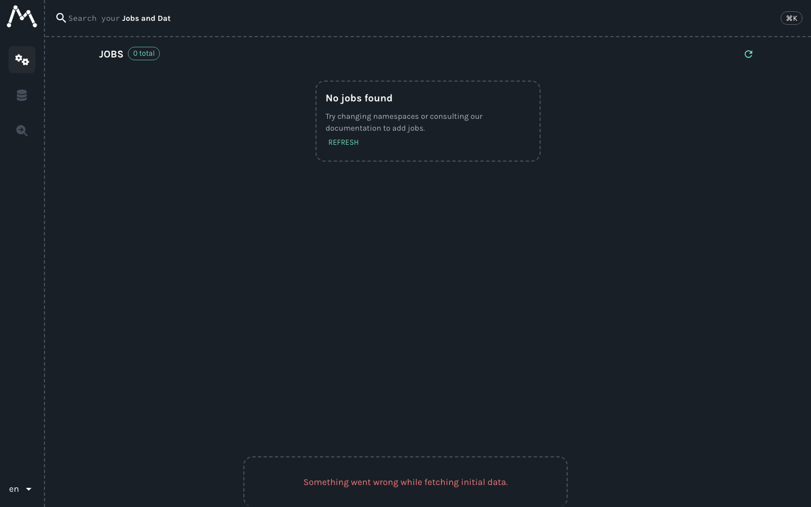 | 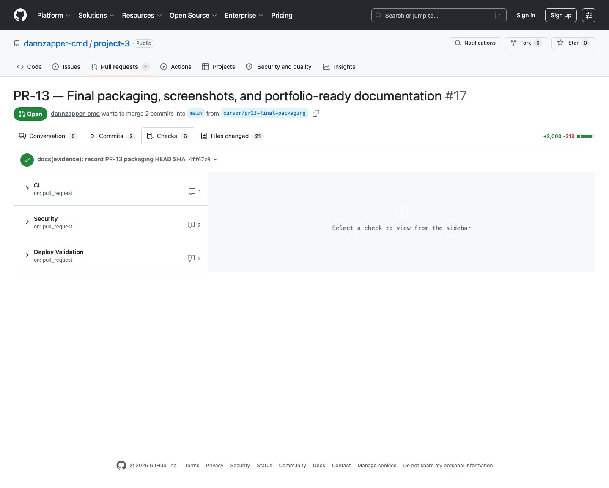 |

More: [screenshots folder](docs/assets/screenshots/) · [screenshot guide](docs/screenshots.md)

## Live API Demo

**Live Cloud Run demo of the read-only AI Operations API** — not production.

- [Health](https://invforge-ai-demo-289428962093.us-central1.run.app/health)
- [OpenAPI docs](https://invforge-ai-demo-289428962093.us-central1.run.app/docs)
- [Metrics](https://invforge-ai-demo-289428962093.us-central1.run.app/metrics)

This live Cloud Run demo exposes **only** the read-only AI Operations API.
Streamlit dashboard, MLflow, ZenML, InvenTree, retraining, and Kubernetes
profiles remain **local-only**. Mutation endpoints are blocked
(`INVFORGE_ALLOW_MUTATIONS=false`).

Evidence: [PR-14 Cloud Run report](docs/evidence/PR14_CLOUD_RUN_LIVE_DEMO.md)

| Cloud Run health | Cloud Run docs | Mutation blocked (403) |
|---|---|---|
| 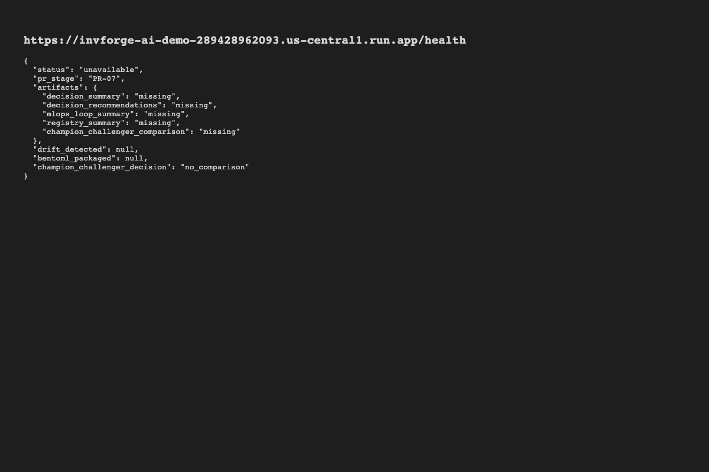 |  | 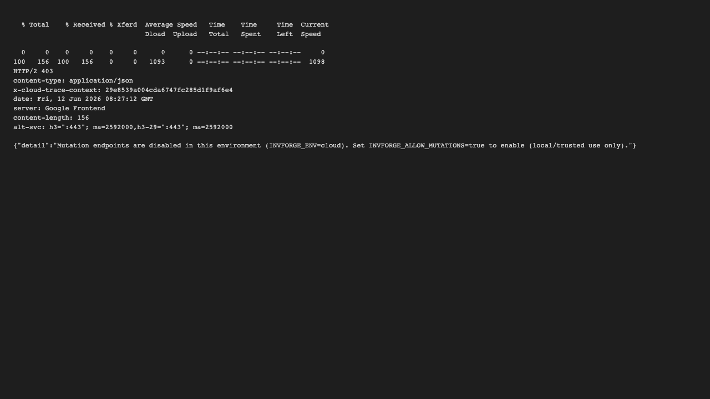 |

## Architecture

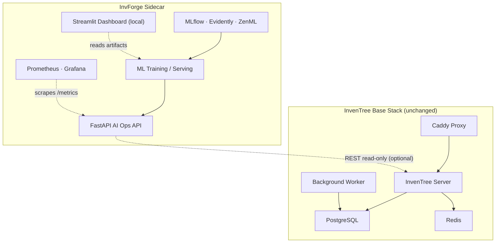

Full reference: [architecture overview](docs/architecture-final.md)

## Business case

Inventory teams often rely on fragmented spreadsheets, reactive reorder rules, and delayed visibility into stockout risk. InvForge adds a practical **AI Operations layer** that:

- Surfaces **stockout/overstock risk** for ops review cycles
- Produces **ranked reorder recommendations** from forecast quantiles
- Exposes **model health and drift status** for governance conversations
- Ships a **deployable read-only API** technical teams can run beside existing ERP/inventory systems

The value is **decision support**, not autonomous magic. All quantified cost metrics in the demo are **synthetic backtest diagnostics** — not production ROI. See [case study](docs/case-study.md).

## Demo scenario

Concrete SKU story for reviewers: [examples/demo-scenario/](examples/demo-scenario/)

```bash
make demo-local    # data → ML → MLOps → dashboard smoke (no Docker/k8s)
make dashboard     # interactive Streamlit at http://localhost:8501
```

## Quick start

### Prerequisites

- Docker and Docker Compose v2 (for InvenTree and optional observability)
- [uv](https://docs.astral.sh/uv/) (Python 3.12+)
- Make

### Install and run

```bash
uv sync --group dev --group pipeline --group ml --group mlops --group dashboard --group observability
cp app/.env.example app/.env
make demo-local
make dashboard          # http://localhost:8501
make observability-api  # http://localhost:8001 — separate terminal
```

One-command offline chain: **`make demo-local`** (no long-running servers).

Step-by-step: [quick demo walkthrough](docs/tutorials/quick-demo-walkthrough.md) · [5–8 min demo script](docs/demo-script.md)

## What a reviewer can run locally

| Command | What you get |
|---------|--------------|
| `make demo-local` | Full synthetic pipeline + dashboard smoke |
| `make dashboard` | Streamlit AI Operations control tower |
| `make observability-api` | FastAPI with `/health`, `/metrics`, `/docs` |
| `make observability-up` | Local Prometheus + Grafana (Docker) |
| `make docker-smoke` | Build + run deployable AI Ops container |
| `make deploy-validate` | Offline validation of 66 deploy files |
| `make k8s-up` / `obs-k8s-up` / `lineage-up` | Optional kind profiles (sequential on 8 GB Mac) |

Backend deep-dive: [backend and ML explainer](docs/tutorials/backend-and-ml-explainer.md)

## What is deployable publicly

Only the **read-only AI Operations API** container (repo-root `Dockerfile`):

- `GET /health`, `GET /metrics`, `GET /v1/inventory/status`, `GET /v1/data/summary`
- Mutation endpoints **blocked** in demo/cloud mode

Preferred target: **GCP Cloud Run** (scale-to-zero, low-cost demo). Activation: [GCP guide](docs/cloud/gcp-cloud-run-activation.md)

Contract: [deployment contract](docs/deployment-contract.md)

## What remains local-only

- Streamlit dashboard, MLflow, ZenML, retraining UI
- InvenTree base stack (external system of record)
- Synthetic/processed data artifacts (`mlruns/`, `artifacts/`)
- kind Kubernetes profiles (local evidence, not managed cloud k8s)
- Docker Prometheus/Grafana stack

## Validation and evidence

| Evidence | Path |
|----------|------|
| PR-12.6 senior QA | [docs/evidence/PR12_6_SENIOR_QA_USABLE_DEMO.md](docs/evidence/PR12_6_SENIOR_QA_USABLE_DEMO.md) |
| PR-13 packaging report | [docs/evidence/PR13_FINAL_PACKAGING_REPORT.md](docs/evidence/PR13_FINAL_PACKAGING_REPORT.md) |
| Evidence index | [docs/evidence/README.md](docs/evidence/README.md) |
| Screenshots | [docs/assets/screenshots/](docs/assets/screenshots/) |

Local gates (PR-12.6): 154 pytest passed, `deploy-validate`, `secrets-scan`, `security-check`, `demo-local`, Docker/kind/observability/lineage smoke tests.

## Cloud activation

GCP Cloud Run has a **live read-only demo** (see [Live API Demo](#live-api-demo) above).
AWS and Azure profiles remain activation-ready templates only:

| Provider | Target | Guide |
|----------|--------|-------|
| GCP (primary) | Cloud Run | [docs/cloud/gcp-cloud-run-activation.md](docs/cloud/gcp-cloud-run-activation.md) |
| AWS | ECS Fargate | [docs/cloud/aws-ecs-fargate-activation.md](docs/cloud/aws-ecs-fargate-activation.md) |
| Azure | Container Apps | [docs/cloud/azure-container-apps-activation.md](docs/cloud/azure-container-apps-activation.md) |

Source templates: [deploy/gcp/](deploy/gcp/) · [deploy/aws/](deploy/aws/) · [deploy/azure/](deploy/azure/)

## Security, observability, and MLOps

- **Security:** mutation blocking, audit pipeline, detect-secrets/Bandit/pip-audit/Trivy in CI, SBOM generation — [security/](security/)
- **Observability:** Prometheus metrics, Grafana dashboards, AlertManager alert smoke test — [docs/observability.md](docs/observability.md)
- **MLOps:** MLflow tracking, Evidently drift, champion/challenger, BentoML packaging, ZenML retraining with gated promotion — [docs/mlops.md](docs/mlops.md)
- **Lineage:** OpenLineage → Marquez (optional kind profile) — [docs/runbooks/lineage-inspection.md](docs/runbooks/lineage-inspection.md)

## Limitations

Honest caveats: synthetic data by default, no production savings claims, no live multi-cloud deployment, dashboard local-only, no production auth layer, kind ≠ managed k8s.

Full list: [docs/limitations.md](docs/limitations.md)

## Portfolio and interview prep

- [Case study](docs/case-study.md)
- [Portfolio / CV copy](docs/portfolio-pack.md)
- [Demo script (5–8 min)](docs/demo-script.md)

## Repository structure

```
app/              InvenTree Docker Compose + config (base stack)
api/              FastAPI AI Operations API
ml/               Models, features, training
mlops/            MLflow, Evidently, ZenML, retraining
data/synthetic/   Deterministic synthetic inventory generator
dashboard/        Streamlit AI Operations dashboard (local)
observability/    Metrics, dashboards
security/         Audit, risk scoring
deploy/           Cloud/k8s profiles
docs/             Architecture, case study, evidence, cloud guides
examples/         Demo scenario, sample API JSON
```

## Makefile essentials

| Command | Description |
|---------|-------------|
| `make demo-local` | Chain data → ML → MLOps → dashboard smoke |
| `make dashboard` | Launch Streamlit dashboard |
| `make observability-api` | Start API with `/health` and `/metrics` |
| `make deploy-validate` | Validate deploy profiles (offline) |
| `make docker-smoke` | Build + smoke deployable container |
| `make lint` / `make test` | Ruff + pytest |
| `make secrets-scan` / `make security-check` | Security gates |

Run `make help` for Kubernetes, observability, lineage, and retraining targets.

## PR roadmap

| PR | Scope |
|----|-------|
| PR-01 → PR-11B | Base stack through Senior Edition (k8s, observability, lineage) |
| PR-12 / PR-12.6 | Full QA audit + senior validation + usable demo |
| **PR-13** | Final packaging — case study, screenshots, portfolio docs |

See `PROJECT_3_INVFORGE_MASTER_CONTEXT.md` for full project context.

## Contributing

See [CONTRIBUTING.md](CONTRIBUTING.md).

## License

TBD — InvenTree is MIT licensed; InvForge layer licensing to be defined.
