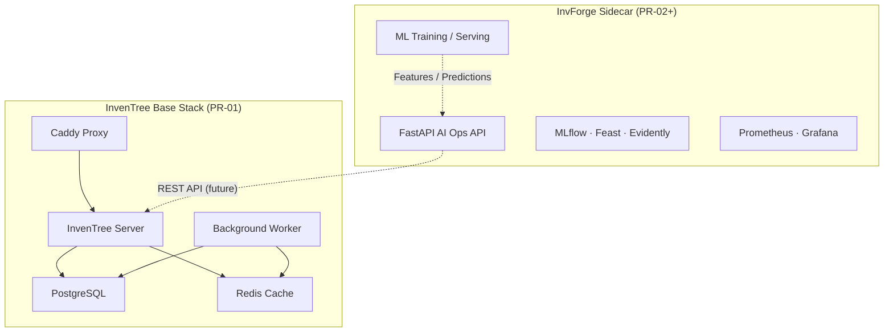

# InvForge — AI Operations Control Tower

[](https://github.com/OWNER/invforge/actions/workflows/ci.yml)

InvForge is an external **AI Operations sidecar** on top of [InvenTree](https://inventree.org/) — an open-source inventory management system. It adds demand forecasting, stockout prediction, MLOps, observability, and decision intelligence **without modifying the InvenTree core**.

> **Status:** PR-01 — base repo setup (InvenTree Docker stack + synthetic data generator).

## Architecture



**Principle:** InvenTree runs unchanged in Docker. All AI/MLOps components are external services that consume InvenTree's REST API (starting in PR-02).

## Repository structure

```
app/              InvenTree Docker Compose + config (base stack)
api/              FastAPI AI Operations API (PR-02+)
ml/               Models, features, training (PR-03+)
mlops/            MLflow, Evidently, ZenML (PR-05+)
data/synthetic/   Deterministic synthetic inventory generator
feast/            Feature store definitions (PR-02+)
observability/    Metrics, dashboards (PR-07+)
security/         Audit, risk scoring (PR-08+)
deploy/           Cloud/k8s profiles (PR-10+)
docs/             Architecture, ADRs, model cards, runbooks
```

## Quick start

### Prerequisites

- Docker and Docker Compose v2
- [uv](https://docs.astral.sh/uv/) (Python 3.12+)
- Make

### 1. Install dev tooling

```bash
curl -LsSf https://astral.sh/uv/install.sh | sh
uv sync --group dev
```

### 2. Configure InvenTree environment

```bash
cp app/.env.example app/.env
# Edit app/.env if needed (defaults use port 8080 for HTTP)
```

InvenTree is pinned to **v1.3.2** via `INVENTREE_TAG` in `.env.example`.

### 3. Start the InvenTree base stack

```bash
make docker-up
```

On first run, initialize the database and static files:

```bash
make docker-init
```

Optional: create an admin user:

```bash
cd app && docker compose run --rm inventree-server invoke superuser
```

Open InvenTree at [http://inventree.localhost:8080](http://inventree.localhost:8080) (or the URL set in `INVENTREE_SITE_URL`).

### 4. Generate synthetic inventory data

```bash
make generate-data
# or:
uv run python data/synthetic/generate_inventory_data.py \
  --output data/synthetic/output --seed 42
```

Outputs CSV files in `data/synthetic/output/`:

| File | Description |
|------|-------------|
| `categories.csv` | Part categories |
| `suppliers.csv` | Suppliers with lead times |
| `parts.csv` | Parts/items with stock levels and reorder points |
| `stock_movements.csv` | In/out/adjustment movements |
| `demand_history.csv` | Daily demand history (~30% intermittent items) |

Data is **deterministic** — the same `--seed` always produces identical output.

## Makefile commands

| Command | Description |
|---------|-------------|
| `make docker-config` | Validate Docker Compose syntax |
| `make docker-up` | Start InvenTree base stack |
| `make docker-down` | Stop InvenTree base stack |
| `make docker-logs` | Tail container logs |
| `make docker-init` | First-time `invoke update` setup |
| `make generate-data` | Generate synthetic inventory CSVs |
| `make lint` | Run Ruff linter |
| `make secrets-scan` | Run detect-secrets scan |
| `make ci` | Run all local CI checks |

## PR roadmap (summary)

| PR | Scope |
|----|-------|
| **PR-01** | Base setup — Docker, repo structure, synthetic data, CI skeleton |
| PR-02 | Data pipeline — ingestion, Feast, validation, DVC |
| PR-03 | ML baseline — LightGBM, Prophet, Croston/SBA, MLflow |
| PR-04 | Decision intelligence — safety stock, EOQ, ROP, quantile loss |
| PR-05 | MLOps loop — Evidently, model registry, BentoML |
| PR-06 | AI Operations Dashboard |
| PR-07 | Observability — Prometheus, Grafana |
| PR-08 | Defensive security |
| PR-09 | Retraining pipeline — ZenML, Optuna |
| PR-10 | Cloud deploy profiles |
| PR-11 | Senior Edition — k8s, LGTM, foundation models |
| PR-12 | Full QA / audit |
| PR-13 | Final packaging — case study, ADRs, demo script |

See `PROJECT_3_INVFORGE_MASTER_CONTEXT.md` for full project context.

## What's NOT in PR-01

- No InvenTree API integration yet
- No MLflow, Evidently, or ML models
- No dashboard, Grafana, Kubernetes, or cloud deploy
- No seeding of synthetic data into InvenTree (CSV generator only)

## Contributing

See [CONTRIBUTING.md](CONTRIBUTING.md).

## License

TBD — InvenTree is MIT licensed; InvForge layer licensing to be defined.
