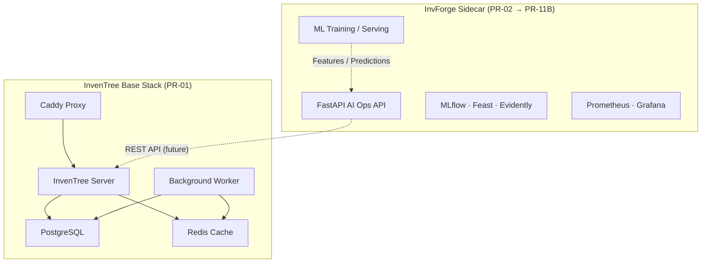

# InvForge — AI Operations Control Tower

[](https://github.com/dannzapper-cmd/project-3/actions/workflows/ci.yml)

InvForge is an external **AI Operations sidecar** on top of [InvenTree](https://inventree.org/) — an open-source inventory management system. It adds demand forecasting, stockout prediction, MLOps, observability, and decision intelligence **without modifying the InvenTree core**.

> **Status:** PR-11B merged (local Kubernetes AI layer plus optional observability
> and lineage profiles). PR-12 is the current full QA/audit hardening pass.

## Architecture



**Principle:** InvenTree runs unchanged in Docker. All AI/MLOps components are external services that consume InvenTree's REST API. Kubernetes work deploys only the AI Operations Layer; observability and lineage are optional local profiles.

## Repository structure

```
app/              InvenTree Docker Compose + config (base stack)
api/              FastAPI AI Operations API (PR-02+)
ml/               Models, features, training (PR-03+)
mlops/            MLflow, Evidently, ZenML (PR-05+)
data/synthetic/   Deterministic synthetic inventory generator
feast/            Feature store definitions (PR-02+)
dashboard/        Streamlit AI Operations dashboard (PR-06)
observability/    Metrics, dashboards (PR-07+)
security/         Audit, risk scoring (PR-08+)
deploy/           Cloud/k8s profiles (PR-10+)
docs/             Architecture, ADRs, model cards, runbooks
```

## Quick start

### Prerequisites

- Docker and Docker Compose v2
- [uv](https://docs.astral.sh/uv/) (Python 3.12+)
- Make

### 1. Install dev tooling

```bash
curl -LsSf https://astral.sh/uv/install.sh | sh
uv sync --group dev --group pipeline
```

### 2. Configure InvenTree environment

```bash
cp app/.env.example app/.env
# Edit app/.env if needed (defaults use port 8080 for HTTP)
```

InvenTree is pinned to **v1.3.2** via `INVENTREE_TAG` in `.env.example`.

### 3. Start the InvenTree base stack

```bash
make docker-up
```

On first run, initialize the database and static files:

```bash
make docker-init
```

Optional: create an admin user:

```bash
cd app && docker compose run --rm inventree-server invoke superuser
```

Open InvenTree at [http://inventree.localhost:8080](http://inventree.localhost:8080) (or the URL set in `INVENTREE_SITE_URL`).

### 4. Generate and validate synthetic inventory data

```bash
make generate-data
make validate-data
# or:
uv run python data/synthetic/generate_inventory_data.py \
  --output data/synthetic/output --seed 42
```

Outputs CSV files in `data/synthetic/output/`:

| File | Description |
|------|-------------|
| `categories.csv` | Part categories |
| `suppliers.csv` | Suppliers with lead times |
| `parts.csv` | Parts/items with stock levels and reorder points |
| `stock_movements.csv` | In/out/adjustment movements |
| `demand_history.csv` | Daily demand history (~30% intermittent items) |

Data is **deterministic** — the same `--seed` always produces identical output.

### 5. Train demand forecast baselines (PR-03)

```bash
uv sync --group dev --group ml
make train-ml
```

This trains a global **LightGBM** model and **StatsForecast** baselines (AutoETS/SeasonalNaive for regular items, Croston/CrostonSBA for intermittent). Metrics and artifacts are logged to local `mlruns/`. See `docs/runbooks/pr-03-ml-baseline.md` and `docs/model-cards/demand_forecast_baseline.md`.

### 6. Generate decision intelligence recommendations (PR-04)

```bash
uv sync --group dev --group ml
make decision-intel
```

This trains additive LightGBM quantile models (`p10/p50/p90`) on the existing
temporal backtest and converts forecasts into synthetic inventory recommendations:
safety stock, reorder point, EOQ, prediction intervals, stockout risk, and
simulated cost-aware metrics. Artifacts are written under `artifacts/decision/`
and logged to local MLflow. Results are **synthetic simulated backtest only**,
not production savings claims. See `docs/decision-intelligence.md`.

### 7. Run the local MLOps loop (PR-05)

```bash
uv sync --group dev --group ml --group mlops
make mlops-loop
```

See `docs/mlops.md` for artifact paths and limitations.

### 8. Launch the AI Operations Dashboard (PR-06)

Generate artifacts first (steps 4–7 above), then:

```bash
uv sync --group dev --group dashboard
make UV="uv" dashboard
```

Non-interactive loader smoke check:

```bash
make UV="uv" dashboard-smoke
```

The dashboard reads PR-03/04/05 artifacts only (no pipeline triggers). See
`docs/dashboard.md` for section details, missing-artifact behavior, and scope.

### 9. Run the AI Operations API

```bash
cp api/.env.example api/.env
make api-dev
make api-health
```

Live read-only ingestion supports two auth options. Token auth is preferred:

```bash
export INVENTREE_BASE_URL=http://inventree.localhost:8080
export INVENTREE_API_TOKEN=<real-token>
unset INVENTREE_USERNAME INVENTREE_PASSWORD
make ingest-inventree
```

For local Docker Desktop smoke tests where token auth fails but direct Basic Auth works, use the Basic Auth fallback:

```bash
export INVENTREE_BASE_URL=http://inventree.localhost:8080
export INVENTREE_API_TOKEN=replace-me
export INVENTREE_USERNAME=admin
export INVENTREE_PASSWORD=<local-admin-password>
make ingest-inventree
```

Raw snapshots are written to `data/raw/inventree/`; normalized CSVs are written to `data/processed/`. These generated folders are ignored by git. Never commit real tokens or passwords.

### 10. Observability (PR-07, local/dev only)

The AI Operations API exposes a `/health` status endpoint and a Prometheus
`/metrics` endpoint. An optional local Prometheus + Grafana stack visualizes
them.

```bash
# Start the API with /health and /metrics:
make UV="uv" observability-api          # http://localhost:8001/health, /metrics

# Optional local Prometheus + Grafana (Docker):
make UV="uv" observability-up           # Grafana: http://localhost:3000 (admin/admin, dev-only)
make UV="uv" observability-down

# Offline smoke check (no Docker, no server):
make UV="uv" observability-smoke
```

This PR-07 Docker Compose stack is **local/dev observability only** — not
production monitoring. PR-11B adds separate optional local-kind observability and
lineage profiles (`make obs-k8s-*`, `make lineage-*`); traces remain idle until
future API instrumentation. See `docs/observability.md` and the PR-11B runbooks.

## Makefile commands

| Command | Description |
|---------|-------------|
| `make docker-config` | Validate Docker Compose syntax |
| `make docker-up` | Start InvenTree base stack |
| `make docker-down` | Stop InvenTree base stack |
| `make docker-logs` | Tail container logs |
| `make docker-init` | First-time `invoke update` setup |
| `make api-dev` | Start the FastAPI AI Operations sidecar |
| `make api-health` | Check the API health endpoint |
| `make ingest-inventree` | Trigger read-only InvenTree ingestion via the API |
| `make generate-data` | Generate synthetic inventory CSVs |
| `make validate-data` | Validate synthetic and processed data with Pandera |
| `make dvc-repro` | Run DVC generate/validate stages |
| `make train-ml` | Train PR-03 demand forecast baselines |
| `make decision-intel` | Generate PR-04 inventory recommendations |
| `make mlops-loop` | Run PR-05 local MLOps loop (drift, registry, champ/chal, BentoML) |
| `make dashboard` | Launch PR-06 Streamlit AI Operations dashboard |
| `make dashboard-smoke` | Non-interactive dashboard loader smoke check |
| `make deploy-validate` | Validate PR-10 deploy profiles/templates (offline) |
| `make deploy-smoke` | Read-only smoke check (`BASE_URL=...`) against a running API |
| `make docker-build-ai` | Build the deployable AI Operations Layer image |
| `make docker-smoke` | Build + run (demo) the AI Ops container and smoke it |
| `make lint` | Run Ruff linter |
| `make test` | Run pytest |
| `make secrets-scan` | Run detect-secrets scan |
| `make ci` | Run core local CI checks (`lint`, `test`, data generation/validation, Docker Compose config when Docker is available) |

Run `make help` for the full target list, including PR-08 security,
PR-09 retraining, PR-11A Kubernetes, PR-11B observability, and lineage commands.

## PR roadmap (summary)

| PR | Scope |
|----|-------|
| **PR-01** | Base setup — Docker, repo structure, synthetic data, CI skeleton |
| **PR-02** | Data pipeline — ingestion, Feast, validation, DVC |
| PR-03 | ML baseline — LightGBM, StatsForecast, Croston/SBA, MLflow |
| PR-04 | Decision intelligence — safety stock, EOQ, ROP, quantile loss |
| PR-05 | MLOps loop — Evidently, model registry, BentoML |
| **PR-06** | AI Operations Dashboard — Streamlit local control tower |
| PR-07 | Observability — Prometheus, Grafana |
| PR-08 | Defensive security |
| PR-09 | Retraining pipeline — ZenML, Optuna, gated promotion, safe rollback |
| PR-10 | Cloud deploy profiles |
| PR-11 | Senior Edition — k8s, LGTM, foundation models |
| PR-12 | Full QA / audit |
| PR-13 | Final packaging — case study, ADRs, demo script |

See `PROJECT_3_INVFORGE_MASTER_CONTEXT.md` for full project context.

## Current limitations / audit notes

- No InvenTree core modifications, forks, vendoring, or patches.
- Cloud profiles are activation-ready templates; no live cloud resources are
  created by default.
- BentoML and blue-green Kubernetes manifests are templated but disabled until a
  real Bento image is built.
- OpenLineage emission is env-gated (`OPENLINEAGE_URL`); Marquez is optional and
  local-only.
- Tempo/OTel backends are deployed in the optional observability profile but idle
  until future API tracing instrumentation.
- No real API tokens, passwords, kubeconfigs, or cloud credentials should be
  committed.

## Reviewer guides (PR-12.6)

- [Quick demo walkthrough](docs/tutorials/quick-demo-walkthrough.md) — run the project from zero
- [Backend and ML explainer](docs/tutorials/backend-and-ml-explainer.md) — architecture and artifacts
- [Demo scenario](examples/demo-scenario/README.md) — concrete SKU story for the dashboard
- [Senior QA evidence](docs/evidence/PR12_6_SENIOR_QA_USABLE_DEMO.md) — latest local validation report

Fast offline chain: `make demo-local` (data → ML → MLOps → dashboard smoke; no Docker/k8s).

## Contributing

See [CONTRIBUTING.md](CONTRIBUTING.md).

## License

TBD — InvenTree is MIT licensed; InvForge layer licensing to be defined.
