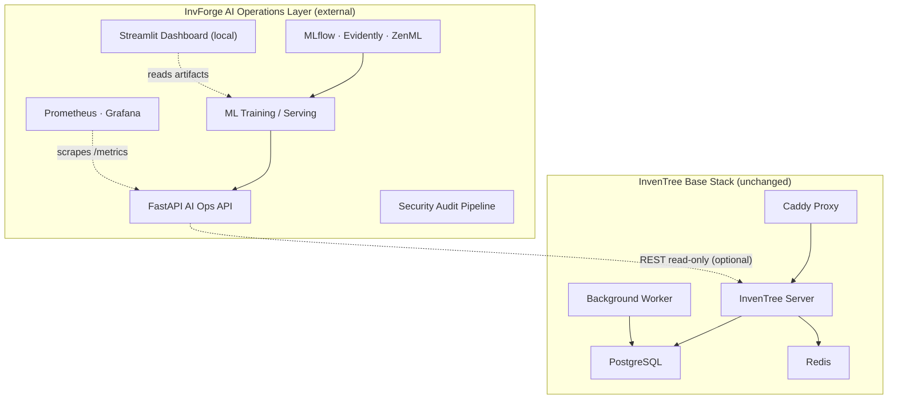
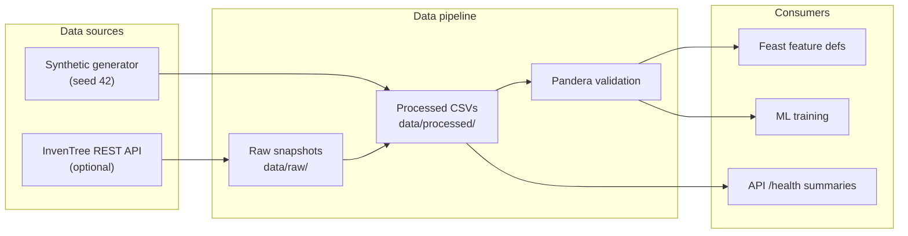
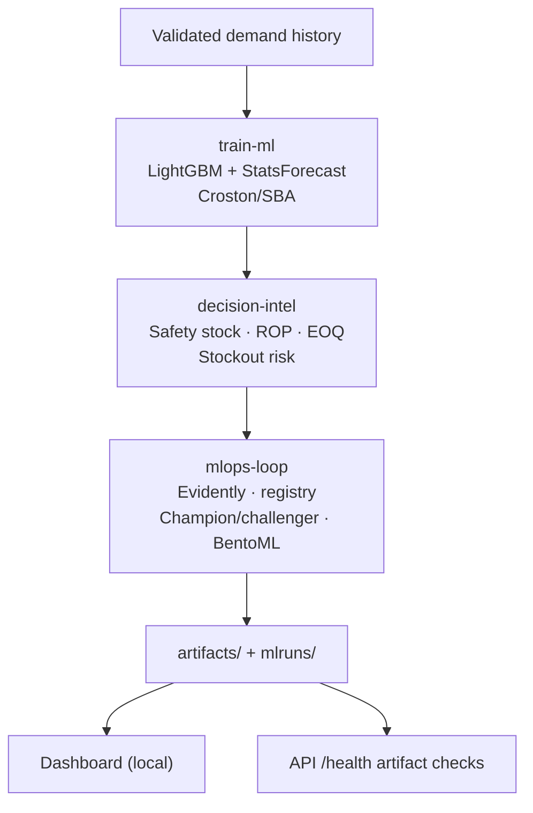
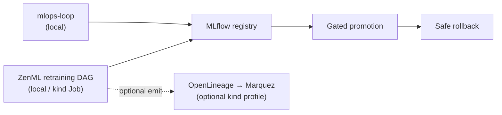
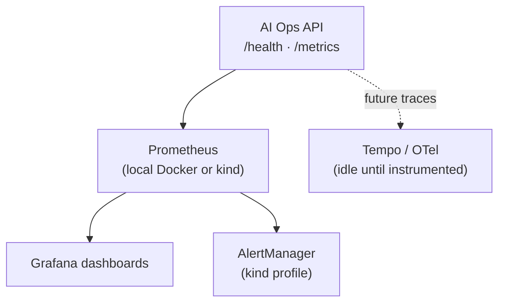
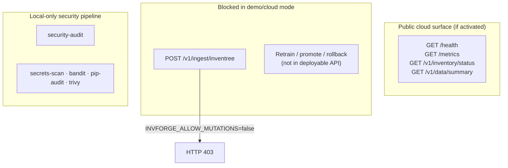

# InvForge — Final architecture overview

InvForge is an **external AI Operations sidecar** over [InvenTree](https://inventree.org/).
It adds forecasting, decision intelligence, MLOps, observability, and defensive
security **without modifying InvenTree core**.

## Sidecar principle

**Key constraint:** InvenTree runs in official Docker Compose images. InvForge
never patches the core. Integration is via REST API (optional) or synthetic data
(default demo path).

## Data flow

Default demo path uses **synthetic data only** — no live InvenTree required.

## Model flow

Forecast outputs include **p10/p50/p90 quantiles**, not point forecasts alone.
Decision intelligence converts quantiles into inventory policy recommendations.

## MLOps and retraining flow

Retraining is **local or kind Job evidence**, not a public cloud endpoint.

## Observability flow

PR-07 Docker stack: `make observability-up` (Grafana on port 3000).
PR-11B kind profile: full LGTM stack with alert webhook smoke test.

## Security boundary

No production auth layer on read-only routes. Mutation blocking is the hard
default for any public deployment.

## Local vs cloud boundary

| Layer | Local/dev | Cloud-deployable |
|-------|-----------|------------------|
| AI Operations API | `make observability-api` | Docker image → Cloud Run / ECS / Container Apps |
| Dashboard | `make dashboard` | Not deployed |
| MLflow/ZenML | Local `mlruns/`, ZenML stack | Not deployed |
| InvenTree | `make docker-up` | External — not part of InvForge deploy |
| kind k8s profiles | `make k8s-up`, `obs-k8s-up`, `lineage-up` | Local kind only |
| Observability Docker | `make observability-up` | Local/dev only |

See [deployment contract](deployment-contract.md) for endpoint classification.

## Kubernetes local profiles

PR-11A deploys **only the AI Operations Layer** to kind:

- Chart: `deploy/k8s/helm/invforge`
- Image: `invforge-ai-ops:local`
- Namespace: `invforge-ai`

PR-11B adds **optional** profiles (never auto-started):

- Observability: `deploy/k8s/observability` → Prometheus, Grafana, Loki, Tempo, AlertManager
- Lineage: `deploy/k8s/lineage` → Marquez + OpenLineage

These prove architecture and smoke tests; they are **not** managed cloud Kubernetes.

## Cloud deployable surface

The repo-root `Dockerfile` builds a single container with the FastAPI sidecar.
Deploy profiles:

| Provider | Target | Guide |
|----------|--------|-------|
| GCP (primary) | Cloud Run | [GCP activation](cloud/gcp-cloud-run-activation.md) |
| AWS | ECS Fargate | [AWS activation](cloud/aws-ecs-fargate-activation.md) |
| Azure | Container Apps | [Azure activation](cloud/azure-container-apps-activation.md) |

**Status:** templates only. No live cloud resources in CI or PR-13.

## Related documents

- [Deployment contract](deployment-contract.md)
- [Backend and ML explainer](tutorials/backend-and-ml-explainer.md)
- [Limitations](limitations.md)
- [Observability](observability.md)
- [MLOps](mlops.md)
- [Decision intelligence](decision-intelligence.md)
